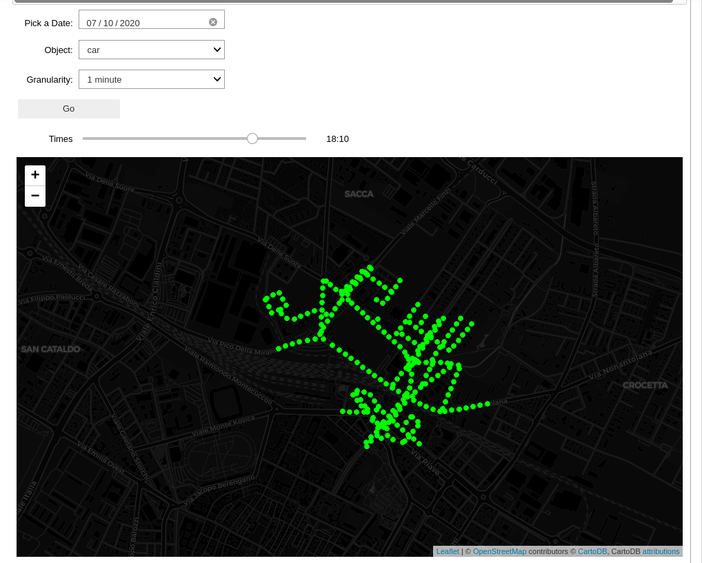
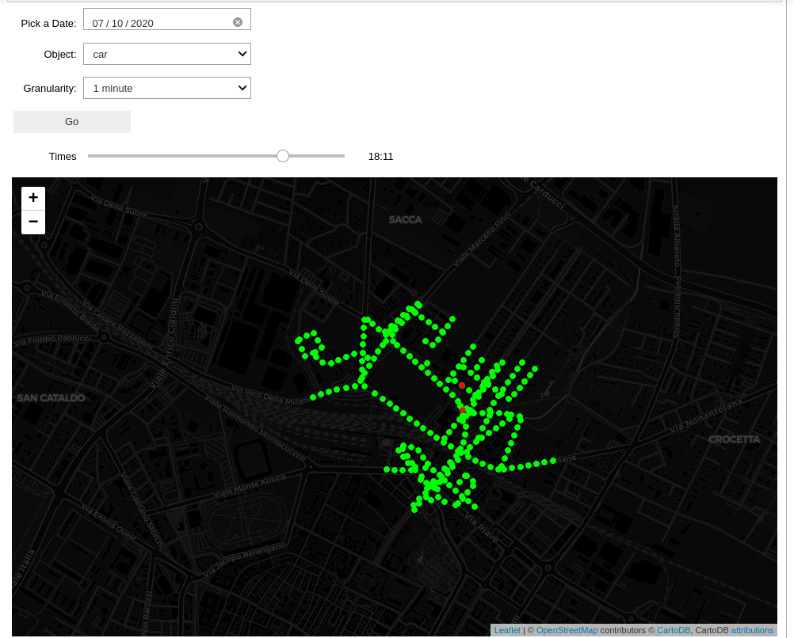

# Tirocinio CLASS - Visualizzatore del traffico

L’obbiettivo di questa fase è quello di implementare un modulo per la visualizzazione degli aggregati ottenuti nelle fasi precedenti. Infatti, si vuole dare all’utente la possibilità di monitorare il traffico ai vari aggregati temporali, con la possibilità di differenziare il traffico in base al tipo di veicolo. Ad oggi non viene mostrata la velocità media in quanto sempre nulla, ma in futuro si può pensare di visualizzarla dato che questa informazione è presente nei dati aggregati.

## Dependencies

Gli strumenti utilizzati sono:
- Jupyter Notebook
- Python 3
- Folium 
- PySpark
- Numpy

## Usage

```bash
mkdir "directory_name"
cd "directory_name"
git init 
git clone https://gitlab.com/francesco-barbanti/visualizzatore.git
jupyter notebook Done.ipynb
```
La prima cella mostra tutti i dati aggregati al minuto presenti nel dataset.\
La seconda cella mostra il traffico in base alla granularità, l'orario, il giorno e il tipo di veicolo scelto. 
Si può notare come scegliendo come data il 10 Luglio 2020 alle 18:10 e come oggetto le macchine, il traffico è sempre scorrevole:\
\
Mentre alle 18:11 nel tratto numero 20 di Strada Nazionale Canaletto Sud un traffico intenso (i dati sono stati generati casualmente).\


I colori dei vari tratti sono stati scelti in base alla densità di oggetti presenti in un determinato tratto. In particolare, se la densità di oggetti è:
- < 30 il traffico è scorrevole (Verde)
- \>= 30 e <= 50 il traffico è scorrevole con qualche rallentamento (Arancione)
- \> 50 il traffico è intenso (Rosso) 


